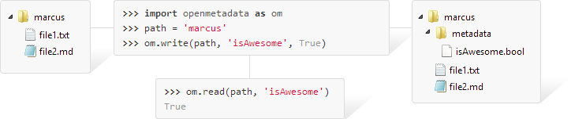

Open Metadata is a Python library used in associating metadata to folders on your file-system.

[](https://travis-ci.org/abstractfactory/openmetadata)
[](https://coveralls.io/r/abstractfactory/openmetadata?branch=master)
[](http://badge.fury.io/py/openmetadata)

### Installing

```bash
$ pip install openmetadata
```

If you're having trouble, refer to the [Wiki](https://github.com/abstractfactory/openmetadata/wiki/Install)

### Quick start

```bash
# Command-line interface
$ mkdir Bruce
$ cd Bruce
$ om write description --value="Turns green when angry"
$ om read description
Turns green when angry
$ om write history --value="Absorbed some gamma radiation"
$ om read history
Absorbed some gamma radiation
```

```python
# Python
>>> import shutil
>>> import tempfile
>>> import openmetadata
>>> root = tempfile.mkdtemp()
>>> openmetadata.write(root, 'age', 32)
>>> openmetadata.write(root, 'height', 1.87)
>>> openmetadata.read(root, 'height')
32
>>> openmetadata.read(root, 'age')
1.87
>>> shutil.rmtree(root)
```

A more in-depth tutorial is available in the [Wiki](https://github.com/abstractfactory/openmetadata/wiki/Tutorial)

### Specifications

Open Metadata is built by specification, refer to the [Wiki](https://github.com/abstractfactory/openmetadata/wiki/Specifications) for more information.

### FAQ

> Who uses Open Metadata?

As part of developing a Digital Asset Management System here at Abstract Factory, we develop Open Metadata as an alternative to databases.

Read more about [us and Pipi here](http://abstractfactory.io)

> Why Open Metadata and not Technology X?

Many alternatives were, and continue to be evaluated. Head over to [RFC24](http://rfc.abstractfactory.io/spec/24/) for an overview.

> I'm using a database for this stuff.

The relational database is proven, reliable and very efficient. It's designed for storage and retrieval of large amounts of static, uniform and small data in a very short amount of time, and it does this well.

Open Metadata was designed for situations where you favour infrequently accessed, heterogenous, sparse and large data; typically true in content creation management systems.

Think of it this way; if the data you're looking to store require fast comparisons and arbitrary queries - like when you're working with billions of bank transactions - then a relational database is probably what you want. On the other hand, if you're building software upon data that changes often, where individual sets of data might end up in the gigabyte-range and where you need control more than you need performance, then Open Metadata is probably what you want. 

Open Metadata is robust, resilient and responds well to change.

> What is programmable content?

In a data-oriented architecture, data controls the flow of information, not your software. Your software is designed to take instructions from data external to itself as a way to de-couple programmers from implementers.

This way, implementers can design their software by means of placing content, in a hierarchy for instance, that governs what actions the software may take in which order.

Open Metadata was designed to facilitate metadata in content management. With metadata in content, it is possible to treat each file or folder as an stateful, intelligent unit capable of making desicions; this is what I call programmable content.

### Usergroup

Have a look at the usergroup if you'd like to interact.
https://groups.google.com/forum/#!forum/open-metadata

[setuptools]: https://pypi.python.org/pypi/setuptools
[pip]: http://pip.readthedocs.org/en/latest/installing.html
[Download repository]: https://github.com/abstractfactory/openmetadata/archive/master.zip
[/examples]: https://github.com/abstractfactory/openmetadata/tree/master/openmetadata/examples
[release]: https://github.com/abstractfactory/openmetadata/releases